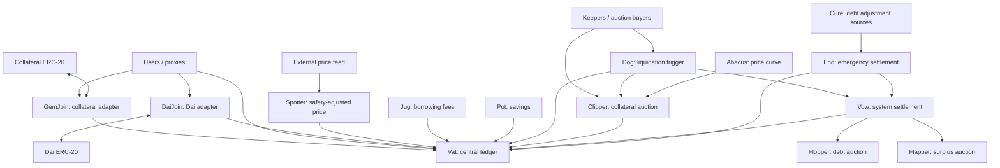

# Multi-Collateral Dai: Architecture Guide

This document explains the DSS architecture.

Source baseline: the inspected [`makerdao/dss`](https://github.com/sky-ecosystem/dss) checkout at the latest commit (`fa4f6630afb0624d04a003e920b0d71a00331d98`). Its Makefile uses DappTools and Solidity 0.6.12. Some source files have broader compiler constraints. This guide describes that checkout, not the complete current Sky deployment.

## 1. What the system does

Multi-Collateral Dai lets users lock approved collateral in vaults and create Dai debt against it. A vault must generally hold collateral worth more than its debt. Users repay debt in Dai to release collateral; unsafe vaults can be liquidated.

“Multi-collateral” means the system supports multiple collateral types. Each individual core vault belongs to one collateral type, called an **ilk**. Different ilks can use the same underlying asset with different risk parameters.

The protocol separates several responsibilities:

- Accounting records collateral, debt, and internal Dai balances.
- Adapters connect accounting to real tokens.
- Pricing and risk parameters determine borrowing capacity.
- Fee modules update borrowing and savings balances over time.
- Liquidation modules sell collateral from unsafe vaults.
- Settlement modules manage system surplus and uncovered debt.
- Emergency shutdown provides a separate final settlement process.

Dai targets a value of one US dollar. A collateral safety check does not force an exchange's Dai price to equal one dollar. The target depends on economic incentives, market activity, and protocol policy as well as accounting.

## 2. Architecture at a glance

The arrows below show important interactions, not every call or permission.



Governance configures parameters and permissions across these modules. External callers submit transactions to update prices, accrue fees, trigger liquidations, and advance auctions. Contracts do not wake up automatically as time passes.

### Contract map

Filenames below refer to the reference DSS repository; they do not prescribe filenames for the rewrite.

| Source | Main contract(s) | Responsibility |
| --- | --- | --- |
| `src/vat.sol` | `Vat` | Core ledger and vault safety rules |
| `src/dai.sol` | `Dai` | Transferable ERC-20 representation of Dai |
| `src/join.sol` | `GemJoin`, `DaiJoin` | Collateral custody and token/accounting conversion |
| `src/spot.sol` | `Spotter` | Converts oracle data into borrowing safety prices |
| `src/jug.sol` | `Jug` | Accumulates stability fees |
| `src/pot.sol` | `Pot` | Accumulates Dai savings returns |
| `src/dog.sol` | `Dog` | Liquidation 2.0 eligibility and initiation |
| `src/clip.sol` | `Clipper` | Liquidation 2.0 descending-price auctions |
| `src/abaci.sol` | Price calculators | Linear or exponential auction price decay |
| `src/cat.sol`, `src/flip.sol` | `Cat`, `Flipper` | Older liquidation and bidding system |
| `src/vow.sol` | `Vow` | Debt queue, surplus, and settlement |
| `src/flap.sol` | `Flapper` | Exchanges surplus Dai for governance tokens |
| `src/flop.sol` | `Flopper` | Raises Dai by issuing governance tokens |
| `src/end.sol` | `End` | Emergency shutdown and collateral redemption |
| `src/cure.sol` | `Cure` | Aggregates adjustments used during shutdown |

## 3. The accounting foundation: Vat

### A ledger independent of tokens

`Vat` is the center of the system. It tracks numbers and permissions without calling external contracts. It does not transfer ERC-20 tokens or query an oracle itself.

Its main records are:

| Record | Meaning | Unit |
| --- | --- | --- |
| `gem[ilk][user]` | Free internal collateral available to the user | wad |
| `urns[ilk][user].ink` | Collateral locked in a vault | wad |
| `urns[ilk][user].art` | Vault's normalized debt | wad |
| `ilks[ilk].Art` | Total normalized debt for that ilk | wad |
| `ilks[ilk].rate` | Accumulated debt multiplier | ray |
| `ilks[ilk].spot` | Safety-adjusted collateral price | ray |
| `ilks[ilk].line` | Debt ceiling for the ilk | rad |
| `ilks[ilk].dust` | Minimum permitted nonzero vault debt | rad |
| `dai[user]` | Internal Dai balance | rad |
| `sin[user]` | Unbacked/system debt assigned to an address | rad |
| `debt` | Total issued internal Dai | rad |
| `vice` | Total unbacked/system debt | rad |
| `Line` | Global debt ceiling | rad |

A core vault, called an **urn**, is identified by `(ilk, address)`. A separate manager can expose numbered vaults or multiple vaults for a single end user, but that interface is outside this core.

Free collateral and locked collateral are different balances. Depositing tokens into an adapter credits free collateral. Locking that collateral in a vault is another accounting operation.

### Units: wad, ray, and rad

Solidity stores integers. DSS assigns fixed-point scales to those integers:

| Unit | Scale | Example |
| --- | --- | --- |
| wad | `10^18` | One normalized collateral unit or one ERC-20 Dai |
| ray | `10^27` | A multiplier of 1.0 |
| rad | `10^45` | One internal Dai |

The important relationship is:

```text
wad × ray = rad

vault debt = art × rate
collateral borrowing capacity = ink × spot
```

These products can be compared without division. A normal safe vault satisfies:

```text
art × rate <= ink × spot
```

For example, normalized debt of `100 × 10^18` and a rate of `1.05 × 10^27` represent `105 × 10^45` internal units: 105 Dai of debt.

### Why normalized debt exists

Updating every vault whenever interest accrues would require looping over all borrowers. Instead, each vault keeps `art`, and all vaults in the same ilk share `rate`.

Increasing the shared rate increases their effective debts without modifying every vault. Debt is recorded at the last rate update, so callers must deliberately accrue fees when fresh accounting is required.

### Important operations

| Function | Effect |
| --- | --- |
| `frob` | Changes locked collateral and normalized vault debt |
| `fork` | Moves collateral and normalized debt between vaults, with consent and safety checks |
| `slip` | Authorized adjustment to free collateral balances |
| `flux` | Transfers free internal collateral |
| `move` | Transfers internal Dai |
| `fold` | Changes an ilk's rate and the corresponding internal Dai balance |
| `grab` | Authorized confiscation/reclassification of vault collateral and debt |
| `heal` | Cancels equal amounts of the caller's internal Dai and system debt |
| `suck` | Creates equal amounts of internal Dai and system debt |
| `cage` | Disables selected normal operations for shutdown |

`frob(ilk, u, v, w, dink, dart)` separates three addresses: the vault owner `u`, free-collateral account `v`, and internal-Dai account `w`.

- Positive `dink` locks collateral; negative `dink` releases it.
- Positive `dart` creates normalized debt; negative `dart` repays it.
- The Dai change is `dart × rate`, not simply `dart`.

Risk-reducing operations receive specific exceptions. For example, adding collateral while reducing debt need not make an already unsafe vault fully safe. Debt increases must respect ceilings; a remaining nonzero debt must satisfy `dust`.

The existence of `suck` is important: authorized modules can create internal Dai paired with system debt without opening a collateralized vault. Savings accrual and liquidation incentives use this mechanism.

## 4. Tokens and adapters

### GemJoin: entering and leaving collateral accounting

A collateral adapter connects one ilk to an external token.

On `join(user, amount)`, it takes tokens from the caller and credits the user's free collateral in `Vat`. On `exit(user, amount)`, it debits the caller's free collateral and transfers tokens to the recipient.

The tokens remain in the adapter while the ledger records whether their corresponding collateral is free, locked, or assigned to an auction.

The basic `GemJoin` in this checkout reads token decimals but does not rescale transfer amounts. Its simplicity must not be mistaken for generic support for arbitrary decimals or unusual token behavior. A rewrite needs explicit normalization for non-18-decimal tokens and a deliberate policy for fee-on-transfer or rebasing assets.

### Dai and DaiJoin: two representations of Dai

`Vat.dai` is the protocol's internal accounting balance. `Dai.balanceOf` is the transferable token balance used outside the core.

`DaiJoin` connects them:

- `exit(user, wad)` moves internal Dai from the caller to the adapter's Vat account and mints ERC-20 Dai to the recipient.
- `join(user, wad)` burns ERC-20 Dai from the caller and moves the corresponding internal Dai from the adapter to the recipient.

Conversion multiplies a token amount in wad by `10^27` to obtain rad. Sub-wad internal remainders cannot be exported as fractional token base units.

Creating vault debt and minting ERC-20 Dai are therefore distinct steps. Moving Dai between representations does not itself change `Vat.debt`.

The reference Dai token also has an older, boolean-based `permit` signature. Replacing it with a modern token implementation may change compatibility.

## 5. Prices, borrowing fees, and savings

### Spotter: a risk-adjusted price

`Spotter` reads an external oracle and writes `spot` into Vat. In ordinary human-readable units:

```text
spot = oracle price / par / liquidation ratio
```

`par` is the reference-currency value assigned to one Dai. With `par = 1`, collateral worth $2,000, and a liquidation ratio of 150%, one collateral unit supports approximately 1,333.33 Dai of debt.

This is borrowing capacity, not the expected auction sale price.

Calling `poke(ilk)` refreshes the value. If the feed reports an invalid value, the implementation writes zero. Oracle freshness and manipulation resistance depend on the external feed design; Spotter is not the entire oracle system. Also, `Dog.bark` requires a positive spot, so an invalid feed producing zero does not automatically liquidate every vault.

### Jug: stability fees on borrowing

`Jug.drip(ilk)` compounds an ilk's rate over elapsed time and calls `Vat.fold`. The per-second growth factor is formed from the global `base` and ilk-specific `duty`.

For a positive rate increase:

1. All outstanding vault debt in that ilk increases through the shared rate.
2. Matching internal Dai is credited to the Vow.
3. Total issued internal Dai increases by the same amount.

Fees are reflected in debt; the module does not pull tokens from every borrower's wallet. Rate parameters are fixed-point per-second factors, not ordinary annual percentage numbers.

### Pot: Dai savings

`Pot` records normalized savings balances `pie`, their total `Pie`, and a shared accumulator `chi`.

```text
user savings value = pie × chi
```

Deposits and withdrawals move internal Dai. `Pot.drip()` advances `chi`; it uses `Vat.suck` to credit accrued savings Dai to the Pot and matching system debt to the Vow.

Savings returns are therefore an explicit system expense. Pot does not automatically transfer each borrower's fees to a corresponding saver, and it does not itself implement a transferable savings-share token.

## 6. A complete borrowing and repayment example

Assume an 18-decimal collateral token, a price of $2,000 per token, a 150% liquidation ratio, `par = 1`, an initial debt rate of 1, and suitable debt ceilings and debt floor.

### Borrowing

1. Alice approves the collateral adapter and deposits 2 tokens. The adapter holds them; Alice receives 2 units of free internal collateral.
2. Alice calls `frob` to lock those 2 units and create 2,000 units of normalized debt.
3. Vat checks the resulting vault: $4,000 of collateral supports approximately 2,666.67 Dai, so 2,000 Dai is within the safety limit.
4. Alice now has 2,000 internal Dai. After granting the adapter the required Vat permission, she calls `DaiJoin.exit`.
5. The adapter receives the internal Dai and mints 2,000 ERC-20 Dai to Alice.

Her collateralization ratio is 200%. This example uses human-readable quantities; actual calls use scaled integers and signed deltas.

### Repayment after fees

Suppose the accumulated rate later becomes 1.05. Alice still has 2,000 normalized debt, but owes 2,100 Dai.

1. Alice obtains 2,100 ERC-20 Dai and grants DaiJoin the necessary token allowance.
2. `DaiJoin.join` burns those tokens and credits 2,100 internal Dai.
3. A negative normalized-debt delta of 2,000 in `frob` consumes 2,100 internal Dai at that rate.
4. Alice can release the collateral and exit it through the collateral adapter.

Burning ERC-20 Dai through DaiJoin alone does not repay the vault. Repayment occurs when Vat reduces the vault debt and consumes internal Dai. With general rates, conversion and rounding must be handled explicitly.

## 7. Liquidation: Dog, Clipper, and price calculators

The checkout contains two generations of liquidation. They share the ledger but are different mechanisms.

### Liquidation 2.0: Dog and Clipper

`Dog` decides whether a vault is eligible and how much can be liquidated. `Clipper` sells the seized collateral through a descending-price auction.

A typical sequence is:

1. A caller invokes `Dog.bark` for an unsafe vault.
2. Dog checks collateral safety and available global/per-ilk liquidation capacity.
3. `Vat.grab` removes the selected collateral and normalized debt from the vault, credits collateral to the Clipper, and assigns the corresponding system debt to the Vow.
4. Dog queues that debt in Vow and starts an auction. The auction's target includes a liquidation penalty.
5. Buyers call `Clipper.take` at the current price, subject to their maximum acceptable price.
6. Buyers receive internal collateral, and internal Dai payment goes to the Vow.
7. If the target is paid, remaining collateral returns to the original vault address as free collateral. If collateral runs out first, any uncovered debt remains for system settlement.

Liquidation reclassifies debt; initiating it does not immediately destroy the Dai that was borrowed.

`Hole` and per-ilk `hole` limit outstanding liquidation targets. `Dirt` and `dirt` track their current amounts. Partial liquidation avoids leaving tiny vault debts or uneconomic auctions; the reference code can exceed the nominal limits in a bounded dust-related case.

The price calculators in `abaci.sol` provide linear, stairstep exponential, or continuous exponential decay. Clipper starts from an oracle-derived price with a configurable multiplier. Auctions may require `redo` after excessive time or price decay.

Clipper can pay initiation/reset incentives using `Vat.suck`. Its purchase flow supports a callback before payment is collected, which enables more complex keeper transactions and makes reentrancy protection important.

### Older liquidation: Cat and Flipper

`Cat.bite` initiates the older liquidation flow. Flipper uses competitive bidding: bidders first increase the Dai bid, then can compete by accepting less collateral once the target is reached.

These contracts are useful for understanding history and compatibility. They are not prerequisites for understanding Dog/Clipper. However, the reference End integrates with both generations, so omitting the older system requires adapting shutdown as well.

## 8. Vow: surplus and system debt

The Vow coordinates settlement using its balances in Vat:

- `Vat.dai[Vow]`: internal Dai available to the system.
- `Vat.sin[Vow]`: system debt assigned to it.
- `Vow.sin[timestamp]` and `Sin`: debt still waiting in the queue.
- `Ash`: debt already assigned to debt auctions.

The two mappings named `sin` have different meanings. Vat holds the debt balance; Vow tracks when queued portions become eligible for further settlement.

`fess` queues debt, `flog` releases it after the delay, and `heal` cancels eligible debt against available internal Dai. Releasing debt from the queue does not erase it.

### Surplus auction: Flapper

When surplus exceeds the required buffer and other conditions are met, Vow can auction a fixed quantity of internal Dai. Bidders offer governance tokens, historically MKR. The winning governance-token payment is burned.

### Debt auction: Flopper

When eligible debt remains and surplus is exhausted, Vow can initiate a debt auction. Bidders supply a fixed quantity of internal Dai and compete to accept fewer newly minted governance tokens.

This raises Dai to settle debt at the cost of governance-token dilution. The auction contracts depend on an external governance-token implementation.

## 9. Emergency shutdown: End and Cure

Shutdown is a staged settlement process, not a universal pause or immediate refund.

The reference `End` coordinates disabling normal operation in Vat, both liquidation engines, Vow, Spotter, Pot, and Cure. Subsequent calls snapshot collateral settlement prices, reconcile outstanding auctions and vaults, establish settlement accounting, and calculate collateral redemption rates.

Important stages include:

- `cage()` starts global shutdown; `cage(ilk)` records per-ilk settlement data.
- `snip` and `skip` unwind auctions from the two liquidation generations.
- `skim` processes vault debt and collateral; `free` releases remaining collateral from debt-free vaults.
- `thaw` fixes the settlement debt amount after the required conditions and delay.
- `flow` establishes per-ilk redemption rates.
- `pack` records a user's committed internal Dai; `cash` redeems collateral under the settlement accounting.

Users receive internal collateral and use its adapter to withdraw actual tokens. ERC-20 Dai must first enter internal accounting for this redemption flow.

`Cure` aggregates debt adjustments reported by registered external sources. End subtracts the reported adjustment when establishing settlement debt. Cure coordinates loading those values and a waiting period; it does not restore ordinary vault solvency.

The `live` flag does not block every function uniformly. Some operations intentionally remain available for settlement. Shutdown behavior must be understood module by module.

## 10. Permissions and external dependencies

### Two distinct permission systems

**Administrative/module authority:** `wards`, managed through `rely` and `deny`, authorizes privileged operations. Each contract maintains its own ward list.

**User accounting delegation:** Vat's `hope` and `nope` control whether another address may operate on a user's accounting balances, subject to each operation's checks.

ERC-20 allowances are a third, separate mechanism. Approving a token transfer does not grant Vat permission.

Adapters need authority to credit collateral; Jug needs authority to change rates; liquidation and shutdown modules need confiscation authority; DaiJoin needs token minting authority. Correct deployment wiring is part of the architecture, not merely setup boilerplate.

### What this repository does not fully supply

A complete deployment also needs collateral and governance tokens, price feeds, governance execution, keepers, deployment/configuration scripts, and user-facing integrations. Vault managers and proxy action libraries can make multi-step flows convenient but are outside the core described here.

Modern Sky products and additional mechanisms such as USDS or a peg stability module are not automatically included by rebuilding these contracts.

## 11. Reading references

- [DSS source at the inspected commit](https://github.com/makerdao/dss/tree/fa4f6630afb0624d04a003e920b0d71a00331d98)
- [Maker/Sky whitepaper](https://makerdao.com/en/whitepaper/) — economic context; the linked page now also includes Sky-era additions.
- [Sky developer documentation](https://developers.skyeco.com/) — broader protocol and integration documentation.


